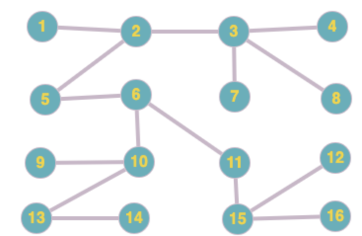

Benas Budrys 5 gr. 2022

## Graphs

> 14. Iš duoto grafo suformuoti medį. (grafo realizacija paremta kaimynystės sąrašais; naudoti paieškos į plotį metodą)

Nodes IDs start from 1 (not 0). Current input data is for the graph below

